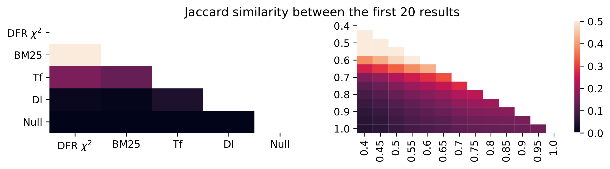

# Validating Synthetic Usage Data in Living Lab Environments

This repository contains the scripts, the experimental data, and the evaluations of **Validating Synthetic Usage Data in Living Lab Environments**. Below, you will find detailed *instructions on how to reproduce the experiments* and *overviews of the scripts and the project structure*.

## Steps to reproduce the experiments and figures of the paper

### 1. Setup and prerequisites

**Prerequisites:** Docker, Python (The experiments were run on Ubuntu 20.04)

#### 1.1. Install Python packages:
```
pip install -r requirements.txt
```

#### 1.2 Install [PyClick](https://github.com/markovi/PyClick):
```
python -m pip install git+https://github.com/markovi/PyClick.git
```

#### 1.3 Obtain the [TripClick](https://tripdatabase.github.io/tripclick/) dataset and place it in the directory corresponding to [`ir_datasets`](https://ir-datasets.com/tripclick.html) or alternatively create a symbolic link to the TripClick dataset files:
```
ln -s path/to/tripclick/ ~/.ir_datasets/
```

#### 1.4 Place the TripClick session logs, i.e., the uncompressed `logs.tar.gz`, in the `./data/` directory.  

#### 1.5 Download [TripJudge](https://github.com/sophiaalthammer/tripjudge) and check if the path to `benchmark.exp.tripjudge.2.grade.csv` in `src/benchmark_bar.py` is correct.
```
git clone https://github.com/sophiaalthammer/tripjudge
``` 

#### 1.6 Start the Docker container running MongoDB.
```
python start_db.py
```

#### 1.7 Write the session logs into the MongoDB:
```
python index_logs.py
```

#### 1.8 Index the TripClick dataset with Pyterrier/`ir_datasets`. The index files are written to `./indices/tripclick/` 
```
python index_tripclick.py
```

#### 1.9 Determine the 50 most frequent queries:
```
python topk_queries.py
```

#### 1.10 Determine the click model parameters for the given queries and sessions
Train the click models with 1-100 sessions and 10 trials. The files with the click model parameters are named by the scheme `<click-model>.<sessions>.<trial>.json`, e.g., `./experimental_results/dctr/params/dctr.100.1.json` for the DCTR model with 100 sessions for the 1st trial:
```
python train.py
```
**Please note that we cannot share the click model parameters publicly as the license of TripClick does not allow to share statistical models or any further resources created based on the datasets.** However, after obtaining the [TripClick](https://tripdatabase.github.io/tripclick/) dataset, it is possible to recreate them with the commands above.

### 2. Rerun the experimental evaluations

#### 2.1 Jaccard similarity between the first 20 documents of the 50 head queries

Determine the Jaccard similarity between the 20 first results for each of the 50 queries for the IRM and LRM systems and writes them to CSV files by the names of `./experimental_results/jacc.irm.csv` and `./experimental_results/jacc.irm.csv`. Afterwards, plot them in heatmaps:
```
python jacc_irm.py && python jacc_lrm.py && python jacc_plt.py
```


#### 2.2 System rankings evaluated by editorial relevance judgments
Evaluate the interpolated retrieval method (IRM) and the lexical retrieval methods (LRM)  based on the editorial relevance judgments of [TripJudge](https://github.com/sophiaalthammer/tripjudge). Afterwards, make bar plots for P@10, nDCG, and AP:
```
python benchmark_irm.py && python benchmark_lrm.py && python benchmark_plt.py
```


#### 2.3 Log-Likelihood 
Determine the LogLikelihood for the IRM and LRM systems evaluated by different click models over an increasing number of sessions (from 1 to 100 sessions).	The scripts output CSV files with file names depending on the click model and the number of sessions, e.g., `./experimental_results/dctr/ll/dctr.ll.irm.50.csv` for the DCTR model with 50 queries.
```
python ll_irm.py && python ll_lrm.py
```
Plot the Log-Likelihood over 100 sessions for all click models and the IRM and LRM systems:
```
python ll_plt.py
```


Plot the Kendall's tau heatmaps based on the Log-Likelihood over different numbers of queries and sessions.
```
python ll_ktau.py
```
<p align="center">
  
  
</p>

#### Interleaving experiments
Determine the outcomes of interleaving experiments for the IRM and LRM systems.
```
python outcome_irm.py && python outcome_lrm.py
```
Plot the bar chart that compares the outcomes of the IRM and LRM interleaving experiments:
```
python outcome_plt.py
```

Plot the heatmap with the Jaccard similarities between winning and losing queries:
```
python jacc_queries_irm.py
```
<p align="center">
  
</p>  
Plot the Kendall's tau heatmaps based on the outcome measure and the relative error of Kendall's tau over an increasing number of sessions:  

```
python outcome_ktau.py && python outcome_rel_err.py
```
<p align="center">
  
  
</p>

## Directories

| Directory | Description |
| --- | --- |
| `./src/` | Contains the Python scripts that are used to reproduce the experiments and figures. |
| `./data/` | Place the TripClick session logs here (the uncompressed `logs.tar.gz`). |
| `./experimental_results/` | Contains the experimental data and figures. |

## Scripts

| Script | Description | Output |
| --- | --- | --- |
| [util.py](./src/util.py) | Contains different utility functions. | - |
| [start_db.py](./src/start_db.py) | Creates and starts a Docker Container running a MongoDB instance. | Docker container running MongoDB |
| [stop_db.py](./src/stop_db.py) | Stops the MongoDB Docker container and optionally removes it. | - |
| [index_tripclick.py](./src/index_tripclick.py) | Indexes the TripClick dataset with ir_datasets | Writes index files to disk, default directory: `./indices/tripclick/` |
| [index_logs.py](./src/index_logs.py) | Parses the sessions logs and writes them into a MongoDB instance. | - |
| [topk_queries.py](./src/topk_queries.py) | Determines the top-k queries and writes them to a csv file. | CSV file containing the top k queries, e.g., `./experimental_results/train.head.50.csv`. |
| [train.py](./src/train.py) | Train a click model with m sessions and n trials | File with click model parameters by the scheme `<click-model>.<sessions>.<trial>.json`, e.g., `./experimental_results/dctr/params/dctr.100.1.json` for the DCTR model with 100 sessions for the 1st trial. |
| [jacc_irm.py](./src/jacc_irm.py) | Determines the Jaccard similarity between the 20 first results for each of the 50 queries for the IRM systems and writes them to a CSV file. | `./experimental_results/jacc.irm.csv` |
| [jacc_lrm.py](./src/jacc_lrm.py) | Determines the Jaccard similarity between the 20 first results for each of the 50 queries for the LRM systems and writes them to a CSV file. | `./experimental_results/jacc.lrm.csv` |
| [jacc_plt.py](./src/jacc_plt.py) | Plots the Jaccard similarity in a heatmap. | `./experimental_results/figures/jacc_sim.pdf` |
| [benchmark_irm.py](./src/benchmark_irm.py) | Evaluates the interpolated retrieval method (IRM) based on the editorial relevance judgments of [TripJudge](https://github.com/sophiaalthammer/tripjudge). | `./experimental_results/benchmark.irm.tripjudge.2.grade.csv` |
| [benchmark_lrm.py](./src/benchmark_lrm.py) | Evaluates the lexical retrieval methods (LRM) based on the editorial relevance judgments of [TripJudge](https://github.com/sophiaalthammer/tripjudge). | `./experimental_results/benchmark.lrm.tripjudge.2.grade.csv` |
| [benchmark_bar.py](./src/benchmark_bar.py) | Plots and compares IRM and LRM systems. | `./experimental_results/figures/benchmarks.tripjudge.pdf` |
| [ll_irm.py](./src/ll_irm.py) | Determines the LogLikelihood for the IRM systems evaluated by different click models over an increasing number of sessions (from 1 to 100 sessions). | Outputs different csv files depending on the click model and number of sessions, e.g., `./experimental_results/dctr/ll/dctr.ll.irm.50.csv` for the DCTR model with 50 queries. |
| [ll_lrm.py](./src/ll_lrm.py) | Determines the LogLikelihood for the LRM systems evaluated by different click models over an increasing number of sessions (from 1 to 100 sessions). | Outputs different csv files depending on the click model and number of sessions, e.g., `dctr.ll.lrm.50.csv` for the DCTR model with 50 queries. |
| [ll_plt.py](./src/ll_plt.py) | Plots the LogLikelihood over an increasing number of sessions for either 5 or 50 queries for the IRM and LRM systems. | `dctr.dcm.sdbn.irm.5.50.ll.pdf` and `dctr.dcm.sdbn.lrm.5.50.ll.pdf` |
| [ll_ktau.py](./src/ll_ktau.py) | Plots the Kendall's tau heatmaps based on the LogLikelihood. | `dctr.ktau.ll.heatmaps.pdf` and `dcm.sdbn.ktau.ll.heatmaps.pdf` |
| [outcome_irm.py](./src/outcome_irm.py) | Determines the outcomes of interleaving experiments for the IRM systems. | `dctr.outcome.irm.50.csv` |
| [outcome_lrm.py](./src/outcome_lrm.py) | Determines the outcomes of interleaving experiments for the LRM systems. | `dctr.outcome.lrm.50.csv` |
| [outcome_bar.py](./src/outcome_bar.py) | Plots the bar chart that compares the outcomes of the IRM and LRM interleaving experiments. | `bar.plots.outcome.50.pdf` |
| [outcome_ktau.py](./src/outcome_ktau.py) | Plots the Kendall's tau heatmaps based on the outcome measure. | `ktau.outcome.heatmaps.pdf` |
| [outcome_rel_err.py](./src/outcome_rel_err.py) | Plots the relative error of Kendall's tau over an increasing number of sessions. | `dctr.sdbn.dcm.rel.err.50.pdf` |
